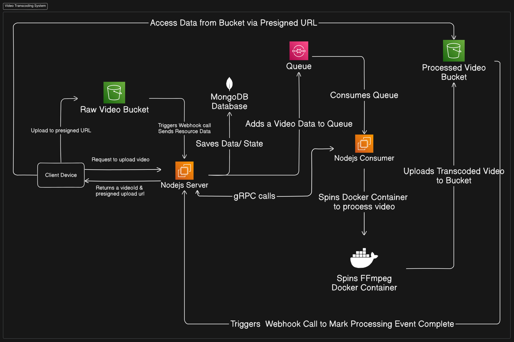

# HLS Adaptive Bitrate Streaming Platform

## Overview
This project is a Http Live Streaming (HLS) - Adaptive Bitrate Streaming platform built using:

- **Backend**: Node.js, Express.js, gRPC, MongoDB
- **Frontend**: React.js (Minimalist UI) built with Vite
- **Video Processing**: FFmpeg
- **Hosting**: Oracle Cloud
- **Architecture**: Decoupled microservices-based architecture

The platform processes raw video uploads and transcodes them into multiple bitrates for adaptive streaming. It uses a messaging queue for efficient task distribution and Docker containers for scalable processing.

---

## Features
1. **Adaptive Bitrate Streaming**: Videos are transcoded into multiple bitrates for smooth streaming across varying network conditions.
2. **Decoupled Architecture**: Independent services communicate using a messaging queue.
3. **Real-Time Notifications**: Video processing status updates are sent to the frontend via `socket.io`.
4. **Scalable Processing**: Uses Docker containers to isolate and scale processing tasks.
5. **Pre-signed URL Uploads**: Uploads are securely handled with pre-signed URLs for raw and processed videos.
6. **Health Checks**: Regular updates are pushed to monitor the health of services.

---

## System Design Diagram


### Workflow Explanation
1. **Client Uploads Video**:
    - The client device requests a pre-signed upload URL from the Node.js server.
    - The server responds with a `videoId` and a pre-signed URL.
    - The client uploads the video directly to the **Raw Video Bucket**.

2. **Video Processing Workflow**:
    - The raw video triggers a webhook call that sends metadata to the Node.js server.
    - The server saves the metadata and state in MongoDB and adds the video processing job to the **Queue**.

3. **Consumer Service**:
    - The Node.js consumer listens to the queue and processes jobs by:
        - Spinning an **FFmpeg Docker Container** to transcode the video into HLS format.
        - Uploading the transcoded video to the **Processed Video Bucket**.

4. **Status Updates**:
    - The gRPC server enables the consumer to update the processing status.
    - Real-time status updates are sent to the client via `socket.io`.

5. **Access Processed Video**:
    - The processed video can be accessed via a pre-signed URL from the **Processed Video Bucket**.

---

## Project Structure
```
HLS-Adaptive_Bitrate_Streaming
│
├── client               # Frontend (React.js + Vite)
├── consumer             # Backend Consumer Service for video processing
├── ffmpeg_worker        # FFmpeg logic for video transcoding
├── server               # Backend Server (Express.js + gRPC)
└── README.md            # Project Documentation
```

### Key Components
1. **Server**:
    - Provides APIs for uploading videos.
    - Manages state and metadata in MongoDB.
    - Sends status updates to the client using `socket.io`.
    - Implements a gRPC server for RPC calls from the consumer.

2. **Consumer**:
    - Consumes tasks from the message queue.
    - Triggers FFmpeg containers for video transcoding.

3. **FFmpeg Worker**:
    - Handles actual video processing.
    - Transcodes raw videos into HLS format.

4. **Client**:
    - A minimalist React.js frontend to upload videos and view processing status.

---

## Environment Variables
The following environment variables must be configured:
```env
MONGODB_URL=your_mongodb_connection_string
BUCKET_NAME=your_raw_video_bucket
BUCKET_NAME_PROCESSED=your_processed_video_bucket
NAMESPACE_NAME=oracle_cloud_namespace_name
ACCESS_URL=base_url_for_accessing_buckets
QUEUE_ID=queue_identifier
QUEUE_ENDPOINT=queue_endpoint_url
GRPC_ADDRESS=grpc_server_address
```
---

## Docker Support
Each service (server, consumer, ffmpeg_worker) is containerized with a `Dockerfile`. Ensure Docker is installed and running.

### Build and Run Containers
1. Build the Docker images:
   ```bash
   docker build -t hls-server ./server
   docker build -t hls-consumer ./consumer
   docker build -t hls-ffmpeg ./ffmpeg_worker
   ```

2. Run the containers:
   ```bash
   docker run -p 3000:3000 hls-server
   docker run hls-consumer
   docker run hls-ffmpeg
   ```

---

## Installation & Setup
1. Clone the repository:
   ```bash
   git clone https://github.com/yourusername/HLS-Adaptive_Bitrate_Streaming.git
   cd HLS-Adaptive_Bitrate_Streaming
   ```

2. Install dependencies for each service:
   ```bash
   cd server && npm install
   cd ../consumer && npm install
   cd ../client && npm install
   ```

3. Configure environment variables in `.env` files for each service.

4. Start services:
   ```bash
   # Start the server
   cd server && npm start

   # Start the consumer
   cd ../consumer && npm start

   # Start the client
   cd ../client && npm run dev
   ```

---

## Usage
1. Start the platform using the above setup instructions.
2. Use the client UI to upload a video.
3. Monitor real-time video processing updates.
4. Access the processed video via the provided URL.

---

## Contributing
Contributions are welcome! Feel free to fork the repository and submit a pull request.

